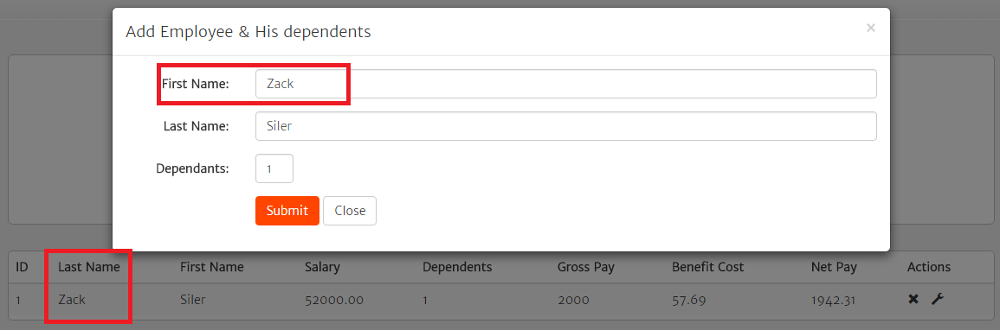
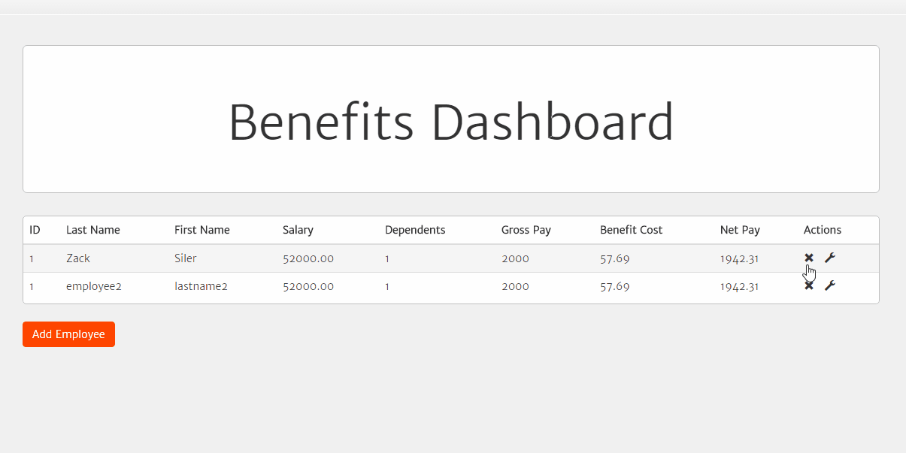
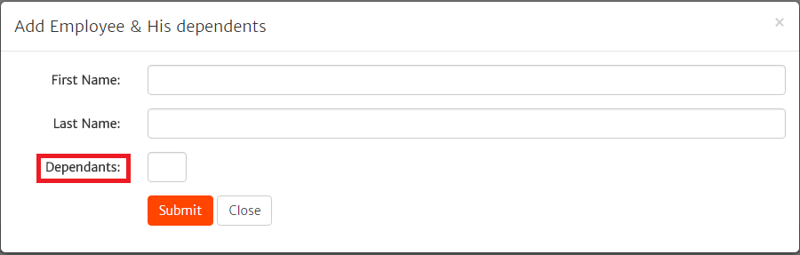
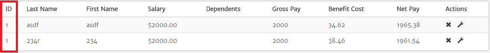
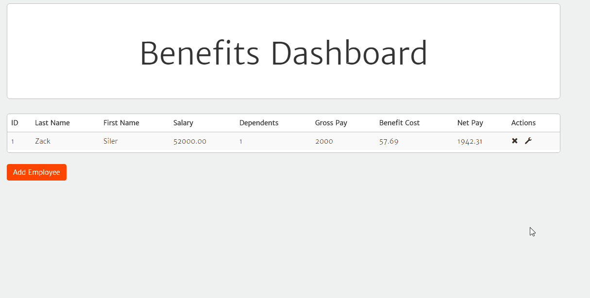
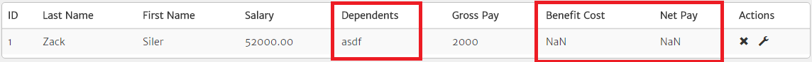
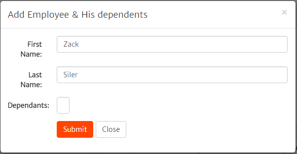

#### First Name and Last Name fields in Table are Mislabeled
##### Steps to Reproduce
1. Login as a user
1. On Benefits Dashboard, click "Add Employee"
1. Enter "First Name" for First Name, and "Last Name" for Last Name
1. Save
1. Observe Employee Table

#####Expected Outcome:
Employee's last name should be within "Last Name" field

#####Actual Outcome: 
"Last Name" field has the first name value.

#####Severity: 
High
#####Priority:
High

#####Screenshot:

#### Double clicking Delete Causes Two Employees to be deleted (Until Adding a new Employee)
##### Steps to Reproduce
1. Login as user
1. On Benefits Dashboard, ensure 2 users exist
1. Double click "Delete" for the first user
1. Observe outcome (Both users are missing from the table)
1. Add a new Employee
1. Observe outcome 

#####Expected Outcome: 
Only the first row should be removed. Additionally, adding a new employee should populate table with only 1 user

#####Actual Outcome: 
Both Employees are removed. When a new user is added, the second deleted employee returs to the able.

The second employee comes back

#####Severity: 
Low
#####Priority:
Medium

#####Screenshot:

#### Dependents Misspelled
##### Steps to Reproduce
1. Login as a user
1. On benefits dashboard, click "Add Employee"
1. Observe "Dependents" field name

#####Expected Outcome :
 "Dependents"

##### Actual Outcome: 
"Dependants"

#####Screenshot:

#### "Add Employee" Modal Heading should read as "Add Employee & His/Her dependents"
##### Steps to Reproduce
1. Login as a user
1. On benefits dashboard, click "Add Employee"
1. Observe Modal Title

#####Expected Outcome: 
Title should be gender neutral ("Add Employee & His/Her Dependents" or "Add Employee & Dependents)

#####Actual Outcome: 
Reads "Add Employee & His dependents" 

#####Screenshot:

#### ID doesn't increment as new entries are added
##### Steps to Reproduce
1. Login as a user
1. On benefits dashboard, add several users
1. Observe ID number in table

#####Expected Outcome: 
ID number should increment

#####Actual Outcome: 
ID doesn't change

#####Severity: 
Low
#####Priority:
High

#####Screenshot:

#### Repeated clicks on the delete button results in permanent spinner icon
##### Steps to Reproduce
1. Login as a user
1. Click Delete icon next to a user repeatedly
1. Observe state

#####Expected Outcome: 
After user is deleted, the user should no longer see the spinner

#####Actual Outcome: 
Spinner icon has become stuck on screen, with the following message in the console:

`employee.js:100 Uncaught IndexSizeError: Failed to execute 'deleteRow' on 'HTMLTableElement': The index provided (-1) is greater than the number of rows in the table (0).`

#####Severity: 
High
#####Priority:
Low

#####Screenshot:

#### No Fields are required
1. Login as a user
1. Click add a new user
1. Fail to populate a field and save
1. Observe page

#####Expected: 
An error message within the modal, detailing what fields are required

#####Actual: 
User is saved without any values entered.

#####Severity: 
Low
#####Priority:
Low

##### Screenshot:
None

#### Dependents accepts negative values
##### Steps to Reproduce
1. Login as a user
1. Click add a new user
1. Enter information, including negative dependents, and save
1. Observe page

#####Expected Outcome: 
An error message within the modal, non-negative values only

#####Actual Outcome: 
User is saved with negative values impacting the benefits cost.

#####Severity: 
Low/Trivial
#####Priority:
Low/Trivial

#####Screenshot:
#####Screenshot:

#### Dependents accepts non-integer values
##### Steps to Reproduce
1. Login as a user
1. Click add a new user
1. Enter information, including a string as Dependents, and save
1. Observe page

#####Expected Outcome: 
Field should only accept numbers, or should present an error that only numeric entries allowed for field

####Actual Outcome: 
User is saved with a string as number of dependents, causing "Benefit Cost" and "Net Pay" to be `NaN` values

#####Severity: 
High
#####Priority:
Medium

#####Screenshot:

#### Dependents Entry information not visible for resolution widths <= 990 px
##### Steps to Reproduce
1. Set resolution width greater than 990 px
1. Login as a user
1. Click add a new user
1. Enter all information, including dependents
1. Resize browser width to be less than or equal to 990 px

##### Expected Outcome:
Dependents field value visible

##### Actual Outcome:
Value not visible.

#####Severity: 
High
#####Priority:
High

#####Screenshot:
